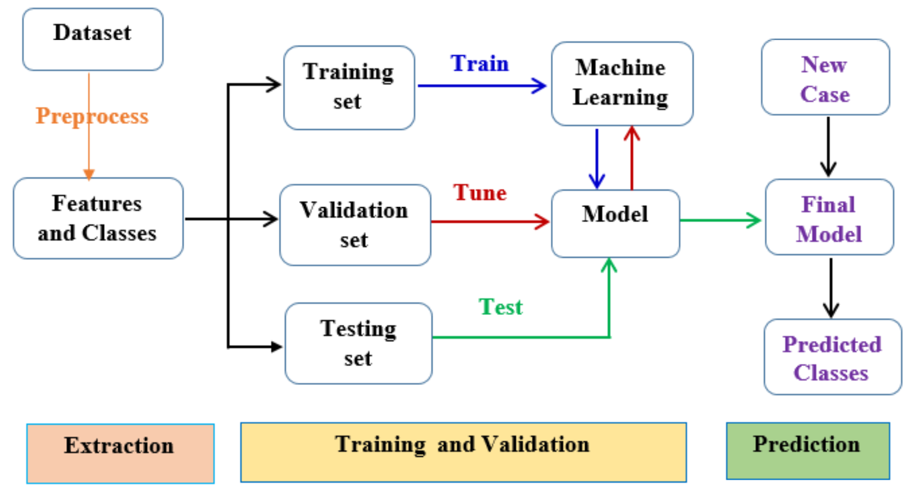
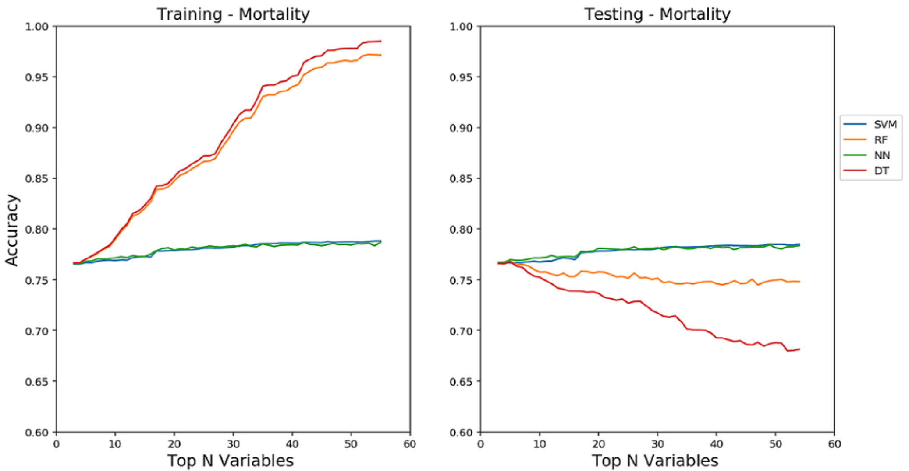

# Predictive Modeling of Frailty Conditions in the Elderly

This repository contains Python code and Jupyter notebooks used in the experiments of  the JMIR 2020 paper:

**"Predictive Modeling for Frailty Conditions in Elderly People: Machine Learning Approaches"**  
Adane Tarekegn, Fulvio Ricceri, Giuseppe Costa, Elisa Ferracin, Mario Giacobini  
*JMIR Medical Informatics*, 2020. [DOI: 10.2196/16678](https://doi.org/10.2196/16678)

---
## ML Workflow Diagram

This figure illustrates the full modeling pipeline from data preprocessing to final prediction used in the study:



---
## Requirements

Install with pip:

```bash
pip install scikit-learn pandas numpy matplotlib seaborn jupyter
```
## Example Results: Mortality Prediction Accuracy

This figure (Figure 3 from the paper) shows the training and testing accuracy of four classifiers — SVM, RF, NN, and DT — as the number of selected features increases. Random Forest and Decision Tree overfit the training data and fail to generalize, while  **SVM** and **ANN (NN)** exhibit **stable generalization** across feature subsets,indicating better robustness.

- **RF** and **DT** show strong overfitting behavior: very high training accuracy, but significant drop in test accuracy as more features are added.
- **SVM** and **ANN (NN)** exhibit **stable generalization** across feature subsets, maintaining similar accuracy between training and test sets, indicating better robustness.





## What’s Included

The notebooks apply machine learning models (SVM, MLP, RF) with:
- 10-fold cross-validation
- Grid search hyperparameter tuning
- Feature selection (e.g., chi-square tests)
- Separate binary classification models for:
  - Mortality
  - Disability
  - Fracture
  - Urgent hospitalization
  - Preventable hospitalization
  - ED admission with red code

## Structure

- `notebooks/`: Jupyter notebooks for each outcome and ML model
- `requirements.txt`: Python dependencies
- `paper/`: Original research paper (PDF)

## Setup

```bash
git clone https://github.com/your-username/ML-Frailty-Prediction.git
cd ML-Frailty-Prediction
pip install -r requirements.txt
